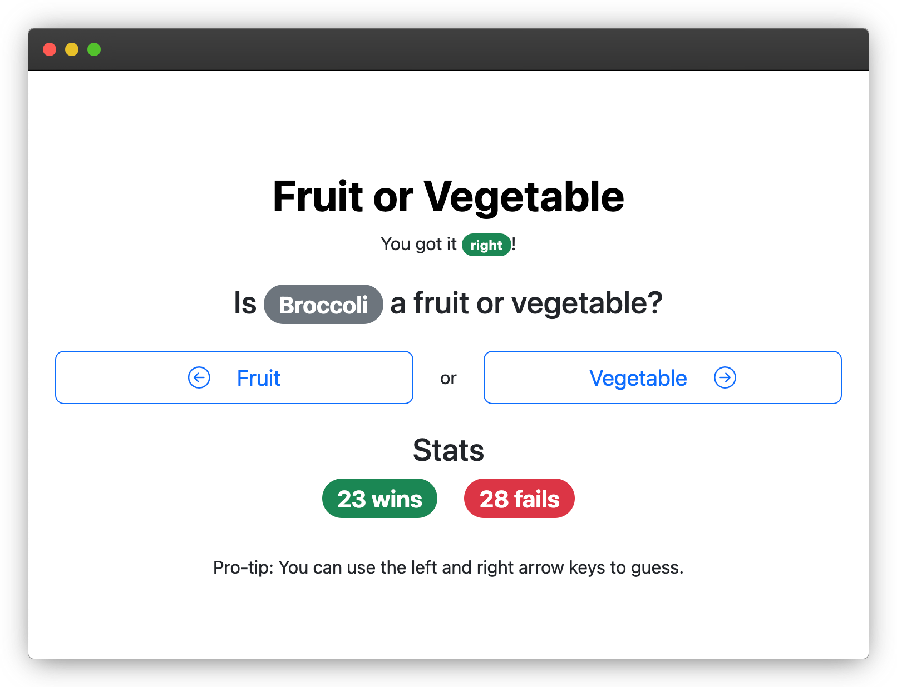

# Fruit or Vegetable React no-build

This is a port of [Fruit or Vegetable](https://github.com/greycastle/fruitorvegetable) that was originally written in Ruby.

This port uses only a single page HTML and React, but without any build tools.

To run this, you will need to host it on a http server to avoid CORS and file loading issues.

Try out [http-server](https://www.npmjs.com/package/http-server) for example.
